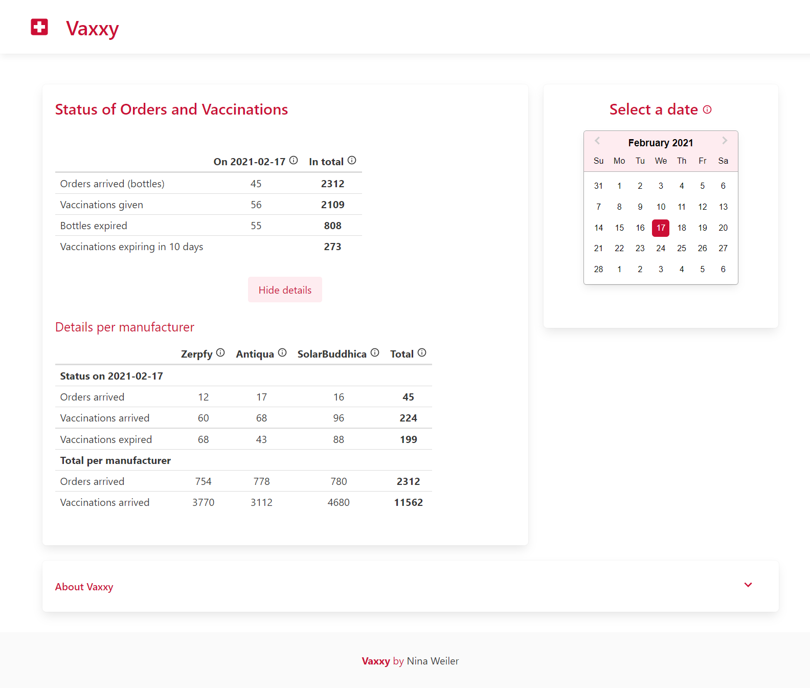

# Vaxxy App


## Project Description
[Programming exercise](https://github.com/solita/vaccine-exercise-2021) for applying to the [Solita Dev Academy 2021](https://www.solita.fi/positions/akatemiasta-nostetta-devaajan-uralle-4447301003/).

The aim of the project was to create a web application for presenting some interesting data about the vaccinations. 

## Demo
A working live version can be found at: 
``` 
[https://vaxxy.herokuapp.com/](https://vaxxy.herokuapp.com/)
```
## Technologies
* React
* Nodejs
* Express
* Redux
* MongoDB
* NPM 
* Bulma.io
* Material UI
* Jest

This project was bootstrapped with [Create React App](https://github.com/facebook/create-react-app).

## Setup
The frontend of the application is in the root folder, and backend (server) is in the backend folder.
* Clone the project repository
* Install the dependencies in the root folder and backend folder with npm. 
```
# Clone this repository
C:/> git clone https://github.com/NinaWeiler/Solita-Vaccination-Excercise.git

# Navigate to the project
C:/> cd Solita-Vaccination-Excercise

# Install dependencies 
C:/> npm install

# Navigate to the backend folder
C:/> cd Solita-Vaccination-Exercise/backend

# Install dependencies 
C:/> npm install
```

### Running the app locally
In the root folder run the command: 
```
C:/> Solita-Vaccination-Exercise

C:/> npm start
```
Now you can open [http://localhost:5000](http://localhost:5000) to view it in the browser. The API endpoints can be accessed in http://localhost:500/api + endpoint. 

### Running frontend and backend in development mode
* Navigate to the backend folder and run project in development mode with the command:
```
C:/> cd Solita-Vaccination-Exercise/backend
C:/> npm run dev
```
* Navigate to the root folder in a different terminal window and run frontend with the command:
```
C:/> cd Solita-Vaccination-Exercise
C:/> npm run start-client
```
Now you can open [http://localhost:3000](http://localhost:3000) to view it in the browser. The backend is running in [http://localhost:5000](http://localhost:3000). 

### Running tests:
The app has tests for the backend. You can all run the tests in the backend directory with the command:
```
C:/> Solita-Vaccination-Exercise/backend
C:/> npm test
```
To run an individual test or set of tests run:
```
C:/> Solita-Vaccination-Exercise/backend
C:/> npm test -- -t 'name of test'
```

## Creating a production build
Creating a build is accomplished by running the following command: 
```
C:/> Solita-Vaccination-Exercise
C:/> npm run build
```

## Author
Nina Weiler